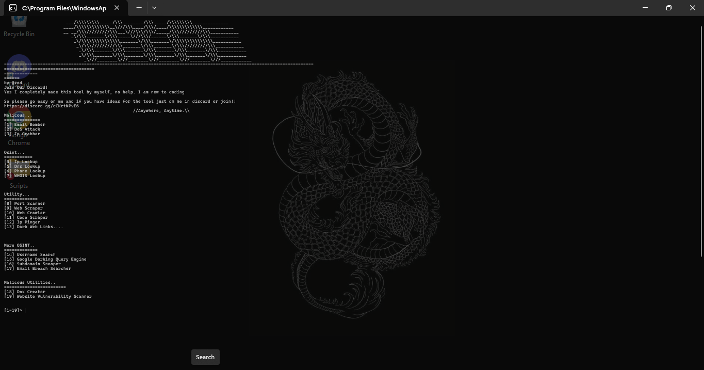
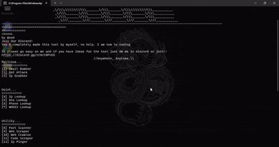

# Aya-Multitool

# 🛠️ AYA MULTITOOL

# YES I will continue to update and add more tools because ilyguys
# it just took me a while to make this cuz i was lazy asf

> "*Anywhere, Anytime.*" - zed

---

## 🔥 THE SWISS ARMY KNIFE 🔥

**OSINT. Network. Malicous (a bit lol) Utility. All in one.**

---

## 💀 What's This?

A multitool with network tools, a few malicious and also malicious utilities OSINT stuff, and utilities. Built for learning and exploring. Nothing more, nothing less.
In progress, so you'll probably see new commits and changes to the tool throughout a few months.

---

## ⚡ Tools

### 💀 Malicious (for testing)
- 📧 Email Bomber - *spam go brrr*
- 💥 DoS Attack - *stress test like a boss*
- 📍 IP Grabber - *catch 'em all*

### 🔍 OSINT
- 🌐 IP Lookup - *where they at?*
- 📡 DNS Lookup - *peek behind the curtain*
- 📱 Phone Lookup - *who's calling?*
- 🏢 WHOIS Lookup - *who owns what*
- 👤 Username Search - *find 'em everywhere*
- 🎭 Dorking Search Query - *exploit google for ya gain and find what wasn't supposed to be found*
- 🏢 Email Data Breach Search - *find breaches in emails without even having to go to your browser (ur welcome!)*
- 🥷 Subdomain Snooper - *find/active hidden subdomains in websites that're trying to hide it from you (how could you! 😭)*

### ⚙️ Utility
- 🔌 Port Scanner - *knock knock*
- 🕷️ Web Scraper - *take what you need*
- 🕸️ Web Crawler - *dig deeper*
- 💻 Code Scraper - *stea- I mean find code*
- 📶 IP Pinger - *is it alive?*
- 🌑 Dark Web Links - *the forbidden fruit*

### ⛏️💀 Malicious Utilities
- 🗒️ Dox creator *a notepad like tool with profiles and saves to build 'fake' info on people (wink wink)*
- 🌩️ Website Vulnerability Scanner *find flaws in websites you own or have permission to use and pentest*
---

## 🚀 Getting Started

Double click `REQUIREMENTS` → double click `Frontscreen` → done.

---

[1] 📧 Email Bomber - spam go brrr
[2] 💥 DoS Attack - stress test like a boss
[3] 📍 IP Grabber - catch 'em all
[4] 🌐 IP Lookup - where they at?
[5] 📡 DNS Lookup - peek behind the curtain
[6] 📱 Phone Lookup - who's calling?
[7] 🏢 WHOIS Lookup - who owns what
[8] 🔌 Port Scanner - knock knock
[9] 🕷️ Web Scraper - take what you need
[10] 🕸️ Web Crawler - dig deeper
[11] 💻 Code Scraper - find code
[12] 📶 IP Pinger - is it alive?
[13] 🌑 Dark Web Links - the forbidden fruit
[14] 👤 Username Search - find 'em everywhere
[15] 🔎 Google Dorking - google knows everything
[16] 🌊 Subdomain Snooper - find the hidden doors
[17] 📨 Email Breach Searcher - who's got breaches?
[18] 📁 Dox Creator - build the profile
[19] 🛡️ Vuln Scanner - find the cracks

---

## ⚠️ Disclaimer

Educational purposes only. Use responsibly. Don't fuck up your day or someone else's.

---

## 💬 Connect

**Discord:** https://discord.gg/cCKctNPvE6

---

## 🤝 Contributing

Ideas? Bugs? Join the Discord, I'm still learning 🙃 *the one man army 😤😤*

---

*Made by @zed*

